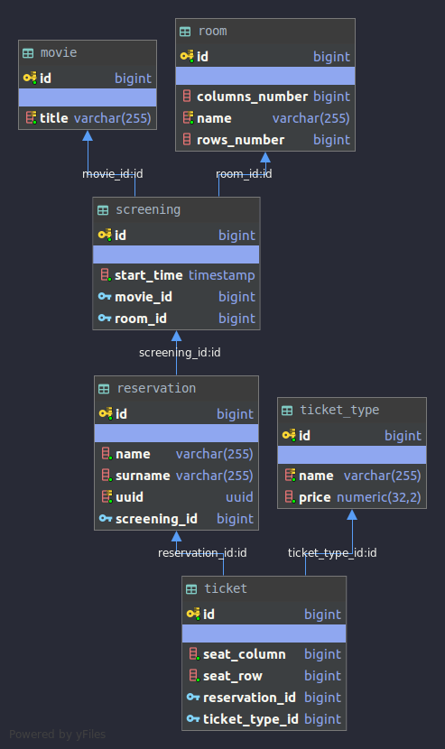

# Metody tworzenia aplikacji bazodanowych - projekt

1. Wstęp i cel
2. Analiza (mile widziane diagramy UMLlub słowny opis zakresu)
3. Architektura techniczna
4. Opis zrealizowanej apliacji ze screenshotami i odnosnikami do rozdziału 2 uzasadniajacymi zrealizowany zakres
5. Zakonczenie z omówieniem dalszych możliwości rozwoju

## 1. Wstęp i cel

Aplikacja służy do rezerwowania miejsc w kinie na spektakle.

### Przypadek użycia:
1. Użytkownik wybiera przedział dat w jakich chciałby zobaczyć film.
2. System zwraca listę dostępnych filmów i ich ekranizacje w danym przedziale czasowym - tytuł filmu i daty w których film będzie można obejrzeć.
3. Użytkownik wybiera konkretną ekranizacje filmu.
4. A. System zwraca pokój w którym odbędzie się ekranizacja, oraz dostępne siedzienia.
4. B. System zwraca typy biletów wraz z cenami.
5. Użytkownik wybiera siedzenia, wybiera typy biletów dla każdego siedzenia, oraz podaje imię i nazwisko osoby rezerwującej bilety.
6. System zwraca użytkownikowi kod który może użyć, aby sprawdzić informacje dotyczące rezerwacji.
7. Użytkownik podaje kod rezerwacji.
8. System zwraca całkowitą sumę do zapłaty za bilety, nazwę sali, datę ekranizacji, nazwę filmu i zarezerwowane miejsca.

### Założenia

1. System pokrywa jedno kino które ma wiele sal.
2. Siedzenie musi być wolne aby dało się je zarezerwować.
3. 3 typy biletów dla dorosłych, dla studentów, dla dzieci (można dodać więcej)

## 2. Analiza

Schemat bazy:

Diagram uml klas warstwy aplikacyjnej:

## 3. Architektura techniczna

- Typowy system typu OLTP(Online transaction processing) - skupiony na zadaniach związanych z transakcyjnym przetwarzaniem
- Baza danych - PostgreSQL
- Warstwa aplikacyjna - Java/SpringBoot
- Api RESTowe, (Dokumentacja api - Swagger): `http://localhost/api/v0.0.1/swaggger-ui.html`
- Docker - odpalenie całej aplicakcji - w kodzie znajduje się plik docker-compose.yml, aby uruchomić aplikacje należy zaintalować Docker oraz docker-compose, a następnie w terminalu odpalić komendę `docker-compose up -d`, alternatywą jest postawienie bazy lokalnie i zbudowanie za pomocą gradle aplikacji.
- Migracja danych jest wykonana za pomocą flywaya przy pierwszym starcie aplikacji, skrypty sql znajdują sie w folderze: `./src/main/resources/migration`, folder ddl zawiera skrypt sql do migracji schematu bazy, natomiast test-dml przykładowe dane z 3 typami biletów, oraz filmami i ich ekranizacjami.

## 4. Opis zrealizowanej apliacji ze screenshotami i odnosnikami do rozdziału 2 uzasadniajacymi zrealizowany zakres

Punkty z przypadków użycia przedstawione w swaggerze:

- Punkty 1 oraz 2

- Punkty 3 oraz 4A

- Punkt 4B

- Punkty 5 oraz 6

- Punkty 7 oraz 8

## 5. Zakonczenie z omówieniem dalszych możliwości rozwoju

System udostępnia podstawowe możliwości rejestracji na ekranizację w kinie. 
Możliwe jest rozwinięcie o dodanie interfejsu graficznego.
Aby system umożliwiał faktyczne użycie możliwe jest dodanie obsługi płatności za zarezerwowane miejsca, alternatywą jest umożliwienie pokazania kodu (zakodowany jako np. QR kod dla uproszczenia skanowania) użytkownika w kinie i dokończenie transakcji na miejscu.
Dodatkowo przydałaby się możliwość wysłania kodu na adres email użytkownika, aby zmniejszyć ryzyko że go zgubi.

